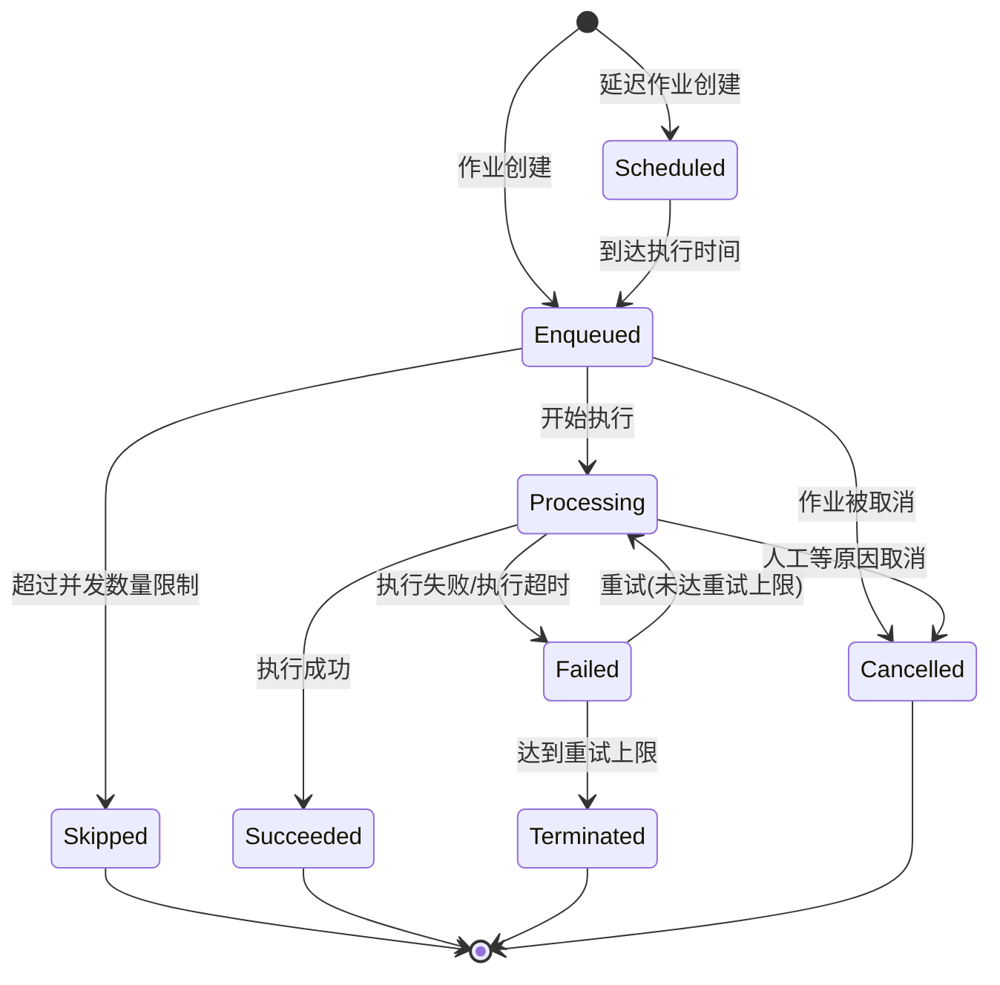
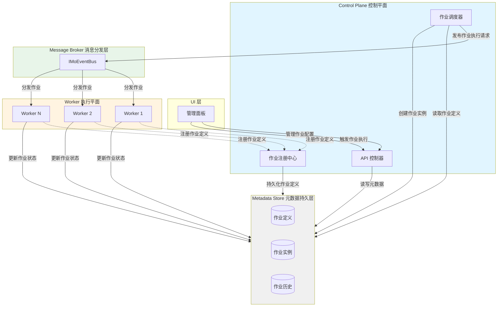

# MoJobScheduler

## 概念

作业仅分为两种作业定义类型：定时作业以及触发式作业。开发者创建作业必须先定义继承自这两种基础作业定义类型的作业类，作业定义构造函数支持依赖注入。
作业执行请求实例由调度器通过作业定义来创建。

### RecurringJob 定时作业
- 定时作业根据定义的周期进行执行，如果周期未定义，则永远不会自动执行。
- 周期可以在面板进行修改，根据 `Crontab` 表达式语法来定义周期。

### TriggeredJob 触发式作业

- 触发式作业与定时作业不同的是它可以传入动态的作业参数（参数需支持Json序列化）
- 一般通过代码触发，也可在面板或通过接口触发。
- 支持提交调度器进行延时触发

### JobOptions

作业配置含有全局配置以及对特定作业通过特性标签进行配置，优先级全局配置低于特性标签。
以下配置会在作业首次加入到调度器注册到元数据持久层，未特殊说明均可进行动态编辑并保存到持久层，后续启动调度器以持久层配置为准。

#### 通用配置

>两种作业都支持的配置项

- **最大并发数量**：相同作业Key的并发执行数量。默认值为`1`，如果超过并发数量，新的作业执行请求将被`Skipped`
- **作业名**：可理解的作业名称，默认值为 `TypeName`
- **重试次数**：默认值为`0`，作业出现异常后立即自动进行重试，会被最大并发数量影响。
- **作业最大执行超时时间**：当作业超过此时间仍未返回结果，则作业视为执行超时失败，Worker执行器会将`CancellationToken`置为以已取消状态来尝试终止该作业（如果作业没有使用取消令牌机制，则该线程将一直被占用，由于`.NET`机制，无法强制杀死后台进程）。默认值为 `1小时`。
- **是否禁用**：是否禁用该作业
- **作业唯一标识符**（无法修改）：用于区分作业定义，需要在整个元数据持久层唯一标志出作业定义，默认值为`TypeFullName`。
- **作业描述**：描述作业业务作用。

#### 定时作业配置
- **定时作业表达式**：`Crontab`表达式语法，支持到秒级。
- **作业结束时间**：作业结束时间，如果为 `null` 表示作业永不结束
- **作业开始时间**：作业只会在此时间之后执行

### WorkerOptions

>作业执行平面的设置

- **最大作业执行线程数量**：同时执行的作业数量，超过此线程数量则被阻塞，不会立即消费作业执行。默认值为`null`，即不会对执行数量进行限制，收到调度器执行请求后立即创建线程进行执行。

### SchedulerOptions

> 控制平面的调度器设置

- **启用定时作业调试模式**：调试模式下所有定时作业都不会自动执行，只能手动在`UI`层触发。
- **启用触发式作业调试模式**：调试模式下所有触发式作业都不会自动执行，只能手动在`UI`层触发。

### JobState
作业执行请求实例状态

1. **Enqueued**：作业已加入队列，等待处理
2. **Processing**：作业正在执行
3. **Succeeded**：作业成功完成
4. **Failed**：作业执行失败
5. **Scheduled**：延迟作业，等待到达执行时间
6. **Terminated**：作业达到重试上限被终止（也代表作业失败）
7. **Cancelled**：作业被人工或各种原因取消
8. **Skipped**：作业由于并发数量上限冲突被忽略执行

## 架构

中心化管理，去中心化执行。
Worker执行平面需要与控制平面设置同一个元数据持久层，执行平面直接修改作业实例信息。

### Control Plane 控制平面

#### 接口定义

##### Work侧
- 作业注册检测
用于Worker批量传入作业唯一标识符，返回有哪些未注册的作业，使用作业注册接口注册。

- 作业注册
批量传入作业定义模型，注册到元数据持久层。

##### UI层
通用：
- 获取所有作业列表
- 创建作业实例
- 查看作业历史
- 取消作业实例执行

定时作业特有：
- 暂停定时作业
- 继续定时作业
- 修改定时作业配置

触发式作业特有：
- 修改触发式作业配置

### Worker 执行平面

#### 接口定义
##### UI

> 与控制平面侧功能相同，但范围需局限在Work服务相关的作业

### Metadata Store 元数据持久层

提供 `IMoJobScheduleMetadataStore` 抽象，提供默认 `MetadataStoreInMemoryProvider` 实现。

### Message Broker 作业分发层

使用 `IMoEventBus` 作为消息中间件，实现交于该模块管理。