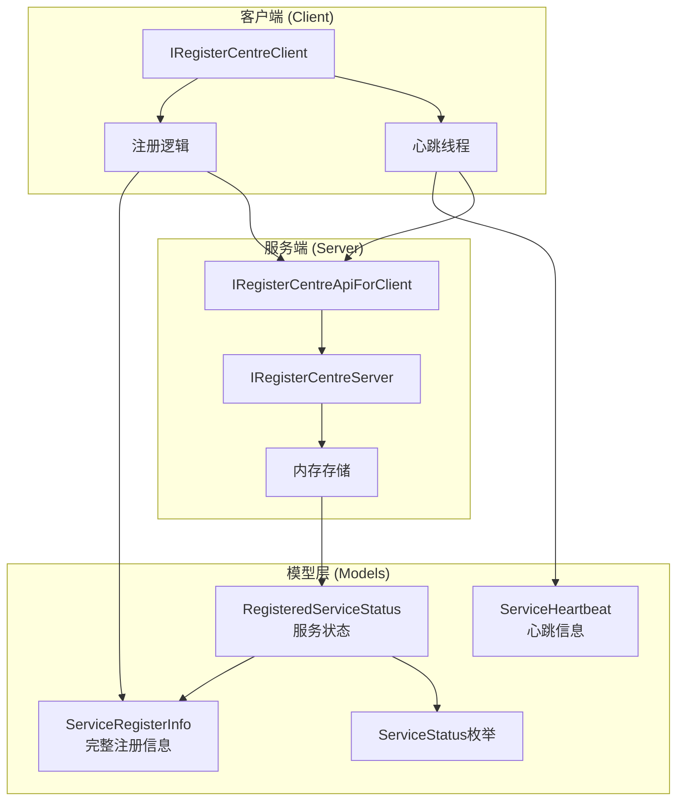
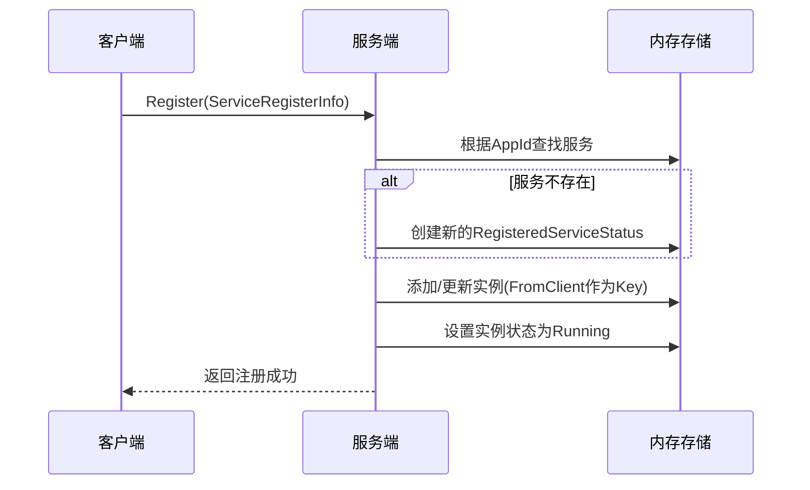
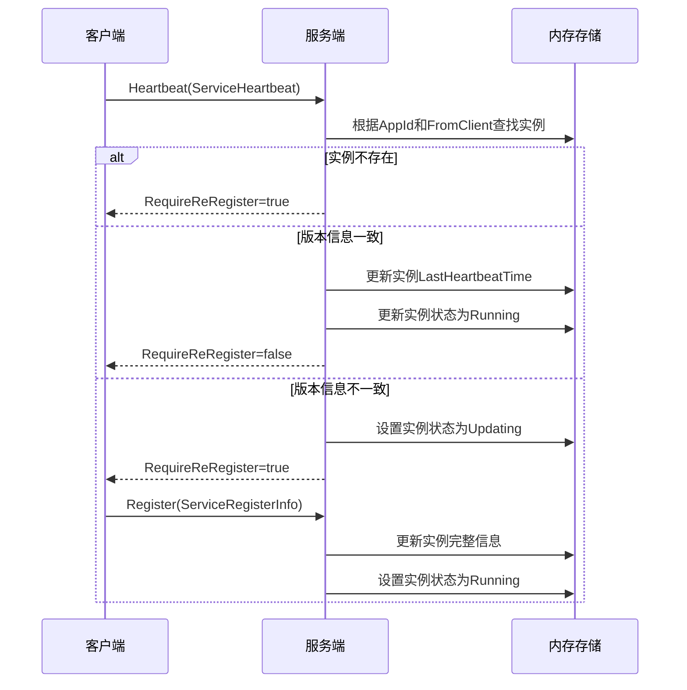
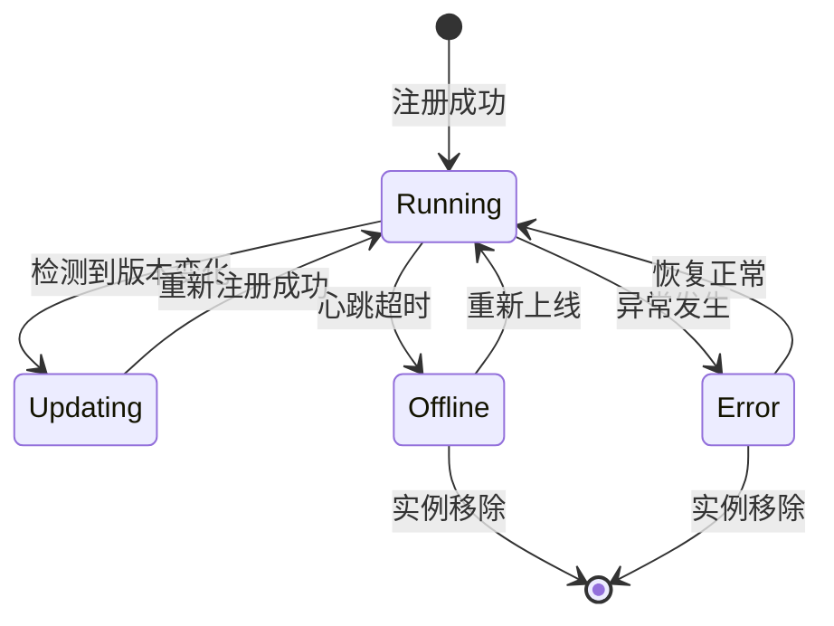

# 注册中心模块架构设计

## 1. 概述

MoLibrary.RegisterCentre 是一个轻量级的微服务注册中心模块，提供服务注册、心跳监测、状态管理等核心功能。本次重构主要目标是优化心跳机制，减少网络传输开销，并增强服务状态管理能力。

## 2. 架构概览



## 3. 核心模型设计

### 3.1 ServiceRegisterInfo (服务注册信息)

保持原有设计，包含服务注册所需的完整信息：

```csharp
public class ServiceRegisterInfo
{
    /// <summary>领域名</summary>
    public string? DomainName { get; set; }
    
    /// <summary>微服务APPID</summary>
    public required string AppId { get; set; }
    
    /// <summary>微服务显示名</summary>
    public required string Name { get; set; }
    
    /// <summary>更新时间</summary>
    public DateTime UpdateTime { get; set; } = DateTime.Now;
    
    /// <summary>微服务构建时间</summary>
    public DateTime BuildTime { get; set; }
    
    /// <summary>微服务程序集版本号</summary>
    public string? AssemblyVersion { get; set; }
    
    /// <summary>微服务发布版本号</summary>
    public string? ReleaseVersion { get; set; }
    
    /// <summary>项目名</summary>
    public required string ProjectName { get; set; }
    
    /// <summary>来源IP端口等信息</summary>
    public string? FromClient { get; set; }
}
```

### 3.2 ServiceHeartbeat (心跳请求模型)

精简的心跳请求，仅包含必要的标识信息：

```csharp
public class ServiceHeartbeat
{
    /// <summary>微服务APPID</summary>
    public required string AppId { get; set; }
    
    /// <summary>微服务构建时间</summary>
    public DateTime BuildTime { get; set; }
    
    /// <summary>微服务程序集版本号</summary>
    public string? AssemblyVersion { get; set; }
    
    /// <summary>微服务发布版本号</summary>
    public string? ReleaseVersion { get; set; }
    
    /// <summary>来源IP端口等信息（用于识别实例）</summary>
    public string? FromClient { get; set; }
}
```

### 3.3 ServiceHeartbeatResponse (心跳响应模型)

```csharp
public class ServiceHeartbeatResponse
{
    /// <summary>是否需要重新注册</summary>
    public bool RequireReRegister { get; set; }
    
    /// <summary>响应消息</summary>
    public string? Message { get; set; }
}
```

### 3.4 ServiceStatus (服务状态枚举)

```csharp
public enum ServiceStatus
{
    /// <summary>运行中</summary>
    Running = 0,
    
    /// <summary>更新中</summary>
    Updating = 1,
    
    /// <summary>离线</summary>
    Offline = 2,
    
    /// <summary>异常</summary>
    Error = 3
}
```

### 3.5 ServiceInstance (服务实例)

单个服务实例的状态信息：

```csharp
public class ServiceInstance
{
    /// <summary>实例标识（FromClient）</summary>
    public required string InstanceId { get; set; }
    
    /// <summary>实例注册信息</summary>
    public required ServiceRegisterInfo RegisterInfo { get; set; }
    
    /// <summary>实例状态</summary>
    public ServiceStatus Status { get; set; }
    
    /// <summary>最后心跳时间</summary>
    public DateTime LastHeartbeatTime { get; set; }
    
    /// <summary>注册时间</summary>
    public DateTime RegistrationTime { get; set; }
    
    /// <summary>累计心跳次数</summary>
    public long HeartbeatCount { get; set; }
}
```

### 3.6 RegisteredServiceStatus (注册服务状态)

组合服务信息与实例状态：

```csharp
public class RegisteredServiceStatus
{
    /// <summary>服务AppId</summary>
    public required string AppId { get; set; }
    
    /// <summary>服务名称</summary>
    public required string ServiceName { get; set; }
    
    /// <summary>领域名</summary>
    public string? DomainName { get; set; }
    
    /// <summary>项目名</summary>
    public required string ProjectName { get; set; }
    
    /// <summary>服务实例字典（Key: FromClient, Value: ServiceInstance）</summary>
    public Dictionary<string, ServiceInstance> Instances { get; set; } = new();
    
    /// <summary>获取运行中的实例数量</summary>
    public int RunningInstanceCount => 
        Instances.Count(x => x.Value.Status == ServiceStatus.Running);
    
    /// <summary>获取总实例数量</summary>
    public int TotalInstanceCount => Instances.Count;
    
    /// <summary>服务整体状态（基于所有实例状态判断）</summary>
    public ServiceStatus OverallStatus => DetermineOverallStatus();
}
```

## 4. 接口重构

### 4.1 IRegisterCentreApiForClient

客户端调用的API接口：

```csharp
public interface IRegisterCentreApiForClient
{
    /// <summary>
    /// 注册微服务
    /// </summary>
    Task<Res> Register(ServiceRegisterInfo req);

    /// <summary>
    /// 发送心跳
    /// </summary>
    Task<Res<ServiceHeartbeatResponse>> Heartbeat(ServiceHeartbeat req);
}
```

### 4.2 IRegisterCentreServer

服务端完整接口：

```csharp
public interface IRegisterCentreServer : IRegisterCentreApiForClient
{
    /// <summary>
    /// 获取所有已注册微服务的状态
    /// </summary>
    Task<Res<List<RegisteredServiceStatus>>> GetServicesStatus();
    
    /// <summary>
    /// 解除所有微服务注册
    /// </summary>
    Task<Res> UnregisterAll();
    
    /// <summary>
    /// Get 方法批量执行调用所有已注册的服务
    /// </summary>
    Task<Dictionary<ServiceRegisterInfo, Res<TResponse>>> GetAsync<TResponse>(string callbackUrl);

    /// <summary>
    /// POST 方法批量执行调用所有已注册的服务
    /// </summary>
    Task<Dictionary<ServiceRegisterInfo, Res<TResponse>>> PostAsync<TRequest, TResponse>(string callbackUrl, TRequest req);
}
```

### 4.3 IRegisterCentreClient

客户端接口保持不变，但返回类型调整：

```csharp
public interface IRegisterCentreClient
{
    /// <summary>
    /// 获取当前微服务状态
    /// </summary>
    public ServiceRegisterInfo GetServiceStatus();
}
```

## 5. 工作流程

### 5.1 服务注册流程



### 5.2 心跳流程



### 5.3 状态转换图



## 6. 关键特性

### 6.1 心跳优化
- **最小化传输**：心跳请求仅包含5个必要字段（AppId、BuildTime、AssemblyVersion、ReleaseVersion、FromClient）
- **智能检测**：服务端比对版本信息，自动触发重新注册
- **实例识别**：通过FromClient字段精确识别和管理各个实例
- **减少带宽**：相比原方案减少约65%的心跳数据传输量

### 6.2 状态管理
- **明确的状态定义**：4种服务状态（Running、Updating、Offline、Error）覆盖完整生命周期
- **实例级状态**：每个实例独立维护自己的状态
- **状态流转控制**：清晰的状态转换规则
- **实时状态追踪**：通过心跳时间判断服务健康度

### 6.3 多实例支持
- **实例识别**：通过FromClient字段唯一标识每个实例
- **独立状态管理**：每个实例维护独立的状态和心跳信息
- **实例计数**：实时统计运行中和总实例数量
- **负载均衡支持**：提供详细的实例信息支持智能路由

### 6.4 版本管理
- **自动版本检测**：通过BuildTime、AssemblyVersion、ReleaseVersion三重验证
- **热更新支持**：检测到版本变化自动标记为"更新中"状态
- **版本追踪**：完整记录服务版本历史

## 7. 总结

本次重构通过分离心跳与注册信息，优化了网络传输效率，增强了服务状态管理能力。新架构具有以下优势：

1. **高效**：心跳数据量减少65%，降低网络开销
2. **智能**：自动检测版本变化，支持热更新
3. **精确**：通过FromClient字段精确管理每个实例
4. **可靠**：实例级状态管理和容错机制
5. **可扩展**：支持多实例部署和负载均衡
6. **可观测**：丰富的状态信息和监控指标

通过这些改进，注册中心将更好地支持微服务架构的稳定运行和动态管理。
